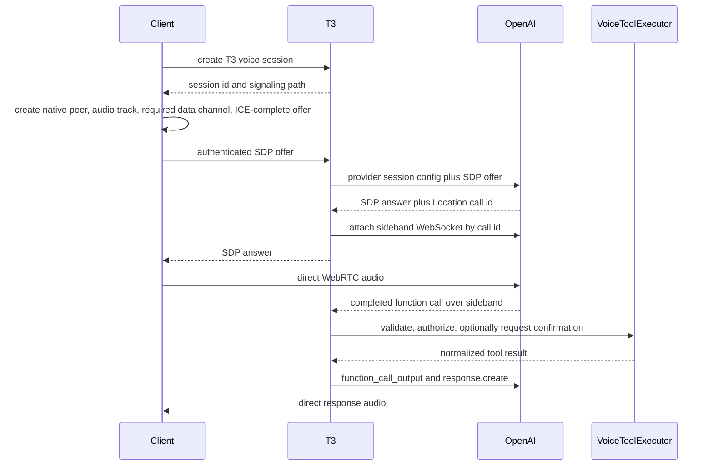

# Voice Architecture

## Status

This document defines the integrated T3 voice architecture. Android is the first semantic-runtime
implementation. The contracts, server seams, and React presentation model are platform-neutral so
future web and desktop adapters can implement the same product behavior without changing the
server protocol.

The authoritative Android product contract, implementation status, and acceptance matrix live in
[the Android voice runtime rebaseline](../../specs/android-voice-runtime-rebaseline.md).

The design has three independent capabilities:

1. bounded speech-to-text for dictation;
2. streaming text-to-speech for reading T3 content;
3. low-latency realtime voice-agent sessions with server-owned T3 tools.

OpenAI is the first voice provider. Provider-specific models, credentials, configuration, tool
protocols, and event shapes remain inside server and platform provider adapters. Clients exchange
only versioned T3 contracts and standardized SDP; they never receive provider credentials or raw
provider control events.

## Decision Summary

- T3 server is the credential, policy, signaling, tool-execution, and audit authority.
- Platform clients own microphone capture, playback, WebRTC, audio routing, and foreground media
  lifecycle.
- Bounded transcription uploads and streaming synthesized audio pass through authenticated T3 HTTP
  media endpoints.
- Realtime agent audio flows directly between the platform client and OpenAI over WebRTC.
- T3 proxies WebRTC session negotiation, captures the provider call ID, and attaches a sideband
  WebSocket to the same provider session.
- Realtime tools execute only on the T3 server against the existing orchestration services.
- Voice tools are a narrow allowlist. No shell, terminal, filesystem, git, or arbitrary MCP tool is
  exposed in the initial implementation.
- Mutating voice tools use a server-enforced interaction policy: create/send dispatch immediately
  with durable idempotency, while interrupt/archive require confirmation.
- No standard provider API credential is delivered to a client.
- Raw audio is not persisted by default.
- Voice sessions are not provider coding sessions. They are short-lived control sessions that can
  inspect and command durable T3 threads.
- Provider calls are never the durable conversation identity. T3 owns a `VoiceConversationId` that
  can span call rotation, reconnects, and cross-device conversation takeover.

## Goals

- Provide native Android push-to-talk dictation and streamed speech playback.
- Provide an OpenAI Realtime voice agent capable of controlling T3 projects and threads.
- Preserve the same authenticated environment boundary used by other remote T3 operations.
- Keep media latency low without turning the T3 server into an audio relay for Realtime sessions.
- Define provider-neutral contracts and services that support additional voice providers.
- Make platform-specific media implementations replaceable and independently testable.
- Support interruption, cancellation, reconnects, partial provider failures, and process lifecycle
  transitions predictably.
- Provide enough telemetry to diagnose latency and media failures without logging credentials or
  raw audio.

## Non-goals

- Ambient wake-word detection.
- Always-on background microphone capture.
- General shell or filesystem control from the voice agent.
- Making the Realtime voice agent a coding-agent provider.
- Relaying Realtime audio through the T3 server.
- Sharing implementation code between Android and iOS media stacks.
- Representing a voice conversation as a T3 coding thread. A durable voice journal is a separate
  record; the user may explicitly send selected transcript content to a coding thread.

## Architecture

```text
Android / iOS / desktop client
  Voice UI and platform media adapter
       |                       |
       | authenticated HTTP    | WebRTC media
       v                       v
T3 environment server       OpenAI Realtime
  VoiceGateway                 ^
  VoiceSessionRegistry         | sideband WebSocket
  VoiceToolExecutor -----------+
  OpenAiVoiceProvider
       |
       +-- ServerSecretStore
       +-- ServerSettings
       +-- VoiceConversationRepository (SQLite)
       +-- ProjectionSnapshotQuery
       +-- ClientCommandDispatcher

T3 authenticated session-event stream --> platform client
```

There are two planes:

- **Media plane:** bounded upload/stream endpoints for STT and TTS, plus direct WebRTC media for a
  Realtime agent.
- **Control plane:** authenticated session creation, capability discovery, signaling, sideband
  provider events, tool execution, state projection, and cancellation.

Binary media is not encoded into the existing JSON RPC protocol. Voice control and state use typed
schemas, while media endpoints use their native content types and streaming bodies.

## Domain Model

### Capability types

```ts
type VoiceCapability =
  | "transcription.request"
  | "transcription.realtime"
  | "speech.streaming"
  | "agent.realtime";
```

The server advertises capabilities instead of forcing clients to infer them from provider names.
Each capability includes supported input/output formats, limits, and whether it is currently ready.

### Identifiers

The shared contracts define branded identifiers:

- `VoiceSessionId`: T3-owned session identity.
- `VoiceConversationId`: T3-owned durable semantic conversation identity.
- `VoiceRequestId`: bounded STT/TTS request identity.
- `VoiceToolCallId`: provider tool-call identity normalized at the T3 boundary.

Provider call IDs and response IDs remain inside the server provider adapter. They may be included
in redacted diagnostics but are not the T3 domain identity.

## Conversation, Session, and Provider Call

T3 deliberately separates three lifetimes:

1. **Voice conversation**
   - T3 product-level identity represented by `VoiceConversationId`.
   - Contains normalized text turns, compacted summaries, tool results, and selected T3 context.
   - Can outlive a provider call and continue on another device.
2. **Voice session**
   - One active T3 client attachment represented by `VoiceSessionId`.
   - Owns one media connection, one fenced client lease, pending confirmations, and transient UI
     state.
   - Ends on explicit stop, takeover, expiry, unrecoverable media loss, or server shutdown.
3. **Provider call**
   - OpenAI Realtime resource identified internally by the provider `call_id`.
   - Owns the provider's in-memory Session object and Conversation items for that call.
   - Has a provider-defined maximum duration and is never used as a durable T3 ID.

There is no permanent master OpenAI call. A durable T3 voice conversation is materialized through
a sequence of bounded provider calls:

```text
VoiceConversationId
  +-- VoiceSessionId on Android
  |     +-- OpenAI call_id A
  +-- VoiceSessionId on desktop after takeover
  |     +-- OpenAI call_id B
  +-- VoiceSessionId after expiry and client restart
        +-- OpenAI call_id C
```

### Durable conversation journal

For conversations with continuity enabled, T3 persists a normalized journal containing:

- final user transcripts;
- final assistant output transcripts;
- compacted summaries;
- normalized tool name, target IDs, confirmation outcome, and compact result;
- active project/thread context changes;
- call-boundary and `device-handoff` markers recording cross-device takeover.

T3 does not persist raw audio, SDP, provider credentials, provider event dumps, or partial audio
deltas. Partial transcripts are ephemeral UI events and are persisted only after finalization.

The journal is the continuity source of truth. The provider's current in-memory Conversation is a
cache for low-latency inference, not the durable record.

### Starting and continuing

Starting voice offers two explicit choices:

- **New conversation:** creates a new `VoiceConversationId` with no prior voice history.
- **Continue conversation:** selects an existing conversation and creates a new session seeded with
  its current compacted summary, recent turns, relevant tool outcomes, and current T3 context.

T3 chooses the bounded continuation window. A client cannot upload arbitrary hidden history as
trusted context.

### Reset and compaction

The user can reset in two ways:

- **New conversation** is a hard semantic reset and receives a new conversation ID.
- **Clear context** starts a new epoch on the existing conversation. Earlier journal entries remain
  visible in history until deleted, but they are excluded from future provider context.

Context selection is T3-owned. The current implementation disables OpenAI automatic truncation and
compiles the newest journal entries that fit the configured token budget whenever a new provider
call starts. Explicit clear-context advances the journal epoch before another call can use the old
entries. Automatic summary generation and seamless context-limit rotation are follow-up work; an
unexpected provider context-limit error ends the current call instead of silently dropping history.

### Cross-device conversation takeover

A voice conversation has at most one active media lease. To continue on another device:

1. the new device requests takeover of the `VoiceConversationId`;
2. T3 atomically increments the media-lease generation, fences the old session, commands its native
   peer to close, explicitly terminates the old provider call, and closes the server sideband;
3. pending write confirmations are invalidated and must be requested again;
4. T3 creates a new voice session and provider call for the new device;
5. the new provider call is seeded from the T3 summary and recent normalized turns;
6. the new device negotiates its own microphone, output route, voice, and WebRTC connection.

This is semantic continuation, not transfer of a live WebRTC peer connection. Completed history and
tool outcomes continue. Uncommitted microphone audio, partially played output, acoustic/prosodic
context, and incomplete provider responses do not.

Changing a Realtime model, provider, device, or output voice does not discard T3 conversation
history. It creates a call boundary and rehydrates the new provider call from the provider-neutral
journal. A voice that has already produced audio cannot be changed inside that OpenAI call, but a
new call may use a different voice. Bounded STT/TTS preset changes affect only their next request.

### Temporary disconnects

The native service lets an existing WebRTC peer handle short network interruptions. It may continue
only if that peer returns to `connected` while its fenced voice-control lease remains live. A native
heartbeat and the server sideband, not the React runtime socket, establish liveness. If either
control side is lost beyond the grace period, the native service closes its peer and T3 explicitly
terminates the provider call. Process loss, `failed`/`closed` peers, and terminal provider events
require a new call from journaled context; no provider-call resumption is assumed.

### Server provider-session modes

```ts
type VoiceSessionMode = "realtime-transcription" | "realtime-agent";
```

Bounded STT and TTS are requests, not durable sessions. Realtime transcription and Realtime agents
are sessions with explicit ownership and cleanup.

### Session state

```ts
type VoiceSessionPhase =
  | "creating"
  | "signaling"
  | "connecting"
  | "idle"
  | "listening"
  | "thinking"
  | "speaking"
  | "confirming"
  | "reconnecting"
  | "ending"
  | "ended"
  | "error";
```

State updates carry a monotonically increasing T3 sequence and relevant correlation IDs. Clients
must not infer a total ordering from provider events alone.

## Shared Contracts

Voice schemas belong in `packages/contracts/src/voice.ts`. That package remains schema-only.

The initial contract surface includes:

- capability descriptors and limits;
- transcription metadata and result;
- speech request metadata;
- voice session create input and result;
- WebRTC offer/answer metadata;
- a normalized `VoiceSessionEvent` union for state, final/partial transcripts, tool progress,
  confirmation requests, lease fencing, rotation, and errors;
- tool call, confirmation request, confirmation response, and tool result summaries;
- typed public errors.

Provider-specific session JSON is never accepted from a client. The server owns model, voice,
instructions, tools, VAD, audio formats, and provider feature flags.

## Authorization

`AuthEnvironmentScope` and the standard client scope grant include `voice:use`. Administrative
`voice:manage` authorizes credential status/set/clear. Media, conversation, session, event, and
confirmation operations require `voice:use`; provider credential mutation requires `voice:manage`.

Tool execution also checks the scope required by the underlying operation on every call:

- read tools require `orchestration:read`;
- mutating tools require `orchestration:operate`;
- voice confirmation does not add authority; for confirmation-gated operations it only satisfies
  the interaction policy for an already-authorized operation.

The authenticated session ID and immutable granted scopes are captured in the T3 voice session.
They are not accepted from a client payload or provider tool arguments. `VoiceSessionRegistry`
subscribes to `SessionStore.streamChanges` and closes voice sessions when their client auth session
is removed. A final active-session check precedes each write.

Current environments are single-user trust domains: any paired client with `voice:use` can list and
continue that environment's durable voice conversations and can explicitly request takeover. Auth
`subject` is not treated as a cross-device user identity. Takeover never moves a journal between T3
environment servers; multi-user conversation ACLs require a future identity design.

## Server HTTP Surface

### Capability discovery

```text
GET /api/voice/capabilities
```

Returns provider-neutral readiness, supported capabilities, media formats, maximum upload size,
maximum realtime duration, and server policy. It never returns provider credentials.

### Conversations and event stream

```text
POST /api/voice/conversations
GET /api/voice/conversations
GET /api/voice/conversations/:conversationId
PATCH /api/voice/conversations/:conversationId
GET /api/voice/conversations/:conversationId/transcript
DELETE /api/voice/conversations/:conversationId
POST /api/voice/conversations/:conversationId/clear-context
GET /api/voice/sessions/:sessionId/events
```

Conversation creation chooses `ephemeral` or `durable` retention explicitly. Durable conversations
appear in list results; ephemeral conversations remain in memory and never appear in durable
history. Clear-context creates a new journal epoch. Delete hard-deletes transcripts, summaries,
context, and tool-call records after ending any lease. Automated age and size retention is not part
of the current implementation.

The authenticated events endpoint returns the current session state and normalized, sequenced
`VoiceSessionEvent` values after an optional sequence. It supports a bounded `waitMilliseconds`
long poll. React may detach without ending native media; the native service separately maintains the
lease heartbeat and closes its peer if server control is lost.

### Bounded transcription

```text
POST /api/voice/transcriptions
Content-Type: multipart/form-data
```

Parts:

- `audio`: required bounded audio file;
- `metadata`: JSON containing optional language and T3-provided vocabulary context.

Response is newline-delimited JSON so recognition can render deltas while the provider finishes:

```json
{"type":"delta","requestId":"voice-request-...","text":"transcribed"}
{"type":"delta","requestId":"voice-request-...","text":" text"}
{"type":"final","result":{"requestId":"voice-request-...","text":"transcribed text","language":"en"}}
```

`language` is optional and echoes the accepted request hint; provider language detection is not
part of the initial contract. The final event is authoritative. Push-to-talk capture is still
bounded and uploads after stop; live microphone transcription uses `realtime-transcription`.

The server currently enforces the configured byte limit before calling the provider. Trusted
container/codec duration probing is still required before the server can advertise and enforce a
duration limit against untrusted clients. The OpenAI adapter initially uses `gpt-4o-transcribe`;
the model is server-owned and is not exposed as an arbitrary client string.

### Streaming speech

```text
POST /api/voice/speech
Content-Type: application/json
Accept: audio/pcm
```

The request includes an ordered playback ID, segment index, final-segment marker, text, and a
server-defined voice preset. The response is a cancellable, backpressured PCM stream. The first
format is 24 kHz, mono, signed 16-bit little-endian PCM.

For a still-streaming T3 thread response, the client phrase chunker emits completed sentences or
bounded clauses without waiting for the full message. The client serializes phrase requests, gives
each response PCM chunk a playback-global monotonic chunk index, and forwards it immediately to
native playback. Native playback drains those chunks in index order and begins as soon as the first
bytes arrive. It coalesces undersized clauses, caps segment size and queue depth, and cancels the
active request plus queued chunks on Stop,
interruption, thread retarget, or environment change. This avoids a custom duplex HTTP protocol
while still speaking before the text response finishes. When the source message completes, React
calls `finishPlaybackAsync({ playbackId, finalChunkIndex })` even if no unsynthesized text remains;
native then ends the queue after that chunk instead of requiring an empty final TTS request.

The OpenAI adapter initially uses `gpt-4o-mini-tts`. Voice and instruction presets are configured
on the server. Clients cannot submit arbitrary provider configuration.

### Realtime session creation

```text
POST /api/voice/sessions
DELETE /api/voice/sessions/:sessionId
```

Create input includes:

- mode;
- a tagged `NewConversation` or `ContinueConversation` choice;
- optional active project and thread IDs;
- client media capabilities;
- client-generated idempotency key;
- explicit takeover intent when continuing an actively leased conversation.

Create returns the T3 voice session ID, policy, initial state, and an opaque WebRTC signaling path.
It does not contact OpenAI until the client submits an offer, preventing abandoned pending sessions
from consuming provider resources.

### WebRTC signaling

```text
POST /api/voice/sessions/:sessionId/webrtc-offer
Content-Type: application/json
Accept: application/json

{ "sessionId": "...", "leaseGeneration": 1, "sdp": "..." }
```

The server:

1. verifies session ownership and state;
2. constructs the provider session configuration;
3. forwards multipart SDP plus server-owned session JSON to OpenAI;
4. reads the OpenAI `Location` header and extracts the call ID;
5. opens the provider sideband WebSocket for that call;
6. returns `{ sessionId, leaseGeneration, sdp }` only after the sideband is attached.

Sideband failure terminates the newly created provider call, marks the T3 session failed, and never
returns a usable answer. Every signaling operation carries the voice session ID and lease generation
so a late SDP answer cannot attach to a replacement session.

After negotiation, WebRTC audio flows directly between the client and OpenAI. T3 remains attached
to the provider session for tools and control.

### Confirmation

```text
POST /api/voice/sessions/:sessionId/confirmations/:confirmationId
```

The JSON body is `{ "decision": "approve" }` or `{ "decision": "reject" }`. Confirmation IDs are
single-use, short-lived, bound to the session principal, normalized tool name, and canonical
arguments. A confirmation cannot be replayed with changed arguments.

### Media tickets

```text
POST /api/voice/media-tickets
```

Traditional React-owned one-shot dictation and playback request one-use tickets through the
authenticated client runtime. A native semantic Thread session uses its bounded native child bearer
to request its own one-use transcription and speech tickets while React is detached or backgrounded.

Every ticket is bound to its issuing auth session, one operation (`transcription-upload` or
`speech-stream`), one request ID, and a short expiry. The matching media route consumes the ticket
once and verifies the request ID. Tickets are stored only in memory, cannot mint credentials or
other tickets, and are invalidated by use, expiry, or auth-session revocation. Media byte, duration,
format, timeout, and concurrency limits are enforced separately by the media routes; tickets are not
bound to a voice-session ID and voice-session closure does not independently revoke them.

## Provider Interfaces

Server runtime interfaces live under `apps/server/src/voice/Services/`.

### Transcriber

```ts
interface Transcriber {
  readonly transcribe: (request: TranscriptionRequest) => Effect<TranscriptionResult, VoiceError>;
}
```

### SpeechSynthesizer

```ts
interface SpeechSynthesizer {
  readonly synthesize: (request: SpeechSynthesisRequest) => Stream<Uint8Array, VoiceError>;
}
```

### RealtimeVoiceProvider

```ts
interface RealtimeVoiceProvider {
  readonly negotiate: (
    request: RealtimeNegotiationRequest,
  ) => Effect<RealtimeProviderSession, VoiceError, Scope>;
}
```

`RealtimeProviderSession` exposes the SDP answer, a normalized event stream, session update/control
operations, tool output submission, explicit provider-call termination, and an explicit close
operation. OpenAI event parsing and provider Realtime/function call IDs do not leak through this
interface.

### Registry and gateway

- `VoiceProviderRegistry` resolves the configured provider adapter per capability.
- `VoiceGateway` validates requests and invokes bounded provider operations.
- `VoiceSessionRegistry` owns scoped realtime sessions, quotas, idempotency, cancellation, and final
  cleanup.
- `VoiceConversationRepository` persists normalized turns, summaries, context epochs, and call
  boundaries without retaining audio.
- `VoiceContextCompiler` creates the bounded provider-neutral continuation context used for new
  calls and cross-device takeover.
- `VoiceToolExecutor` maps normalized tool calls to T3 application services.
- `ClientCommandDispatcher` is extracted from `apps/server/src/ws.ts` and owns setup/worktree,
  startup queue, dispatch, archive cleanup, and terminal-close semantics. WebSocket, orchestration
  HTTP, and voice writes all call it; voice never dispatches directly to
  `OrchestrationEngineService`.

The OpenAI implementation lives under `apps/server/src/voice/Providers/OpenAi/` and depends on an
HTTP/WebSocket client abstraction so tests never require network access.

## Provider Extensibility

Provider abstraction is part of the first implementation, but OpenAI is the only production adapter
required for the initial release. T3 does not implement speculative adapters or reduce every
provider to a lowest-common-denominator protocol.

The abstraction follows capabilities rather than vendors:

- a provider may implement transcription without synthesis;
- a provider may implement synthesis without a Realtime agent;
- bounded and Realtime transcription may come from different provider instances;
- a Realtime provider declares the media transports and features it actually supports.

Clients receive provider-neutral capability descriptors and server-owned presets. They never
receive provider model IDs, API URLs, raw event names, tool schemas, or standard credentials.

Realtime media negotiation uses a versioned transport union. The first member is
`webrtc-sdp-v1`. Future transports are added only when a real provider requires them and a platform
adapter exists. Unknown transports fail as unsupported; there is no fallback that silently changes
media or security behavior.

```ts
type VoiceMediaTransport = {
  readonly kind: "webrtc-sdp-v1";
  readonly signalingPath: string;
};
```

Provider adapters normalize their native events into T3 session events. Conversation persistence,
context compilation, authorization, tools, confirmations, quotas, and audit behavior remain T3
services and are never delegated to an adapter.

The test suite includes a fake provider that implements the same interfaces. Passing those tests is
the proof that OpenAI has not leaked into domain contracts; building a second production adapter is
not required to prove the boundary.

## OpenAI Realtime Flow

T3 uses OpenAI's unified WebRTC interface rather than delivering client secrets to the app.



Realtime sessions are bounded resources. Before the OpenAI 60-minute maximum, T3 emits a terminal
rotation-required event and closes the current native peer/provider call. The client starts a new
`VoiceSessionId` against the same durable conversation, which recompiles continuation context and
creates a new provider call. The current implementation accepts this explicit restart rather than
attempting an atomic peer swap. It never models a Realtime session as a durable T3 thread.

## Realtime Tools

The allowlist is:

- `list_projects`
- `list_threads`
- `get_thread_status`
- `get_thread_messages`
- `wait_for_thread_turn`
- `search_history`
- `read_history`
- `activate_thread`
- `create_thread`
- `send_thread_message`
- `interrupt_thread`
- `archive_thread`

Project and thread summary reads use `ProjectionSnapshotQuery`; bounded messages use the thread
message projection; exact turn waits use the dedicated narrow message/turn outcome projection; and
history tools use `HistorySearchService`. `activate_thread` requests a bounded client action. Mutation
tools create canonical orchestration commands and dispatch them through `ClientCommandDispatcher`;
they do not call HTTP or WebSocket routes from inside the server.

Tool contracts use stable T3 IDs, bounded strings, and explicit result limits. Lists require a
limit and return compact summaries. The server rejects unknown fields and unknown tool names.

### Thread history and bounded turn completion

The Realtime voice agent can inspect existing coding-thread conversation through a bounded
`get_thread_messages` read tool backed by the completed thread-message projection. It accepts a
thread ID, cursor, and limit, and returns normalized user/assistant messages with turn metadata.
Activities, diffs, plans, and tool output are excluded from this message-only result.

Sending work and reading its result are separate operations. `send_thread_message` returns the
dispatch sequence plus stable thread, command, and message identifiers as soon as dispatch is
accepted. The turn ID is not available until the exact message-to-turn start projection resolves.
`wait_for_thread_turn` performs a cancellable bounded wait when the Realtime agent explicitly
needs the result during its current response. It returns `pending`, `running`,
`approval-required`, `user-input-required`, `completed`, `interrupted`, or `failed`, with a bounded
settled assistant message when available. An ambiguous dispatch is returned as `failed` with
`ambiguous: true`; polling never guesses a turn.

There is no asynchronous completion watcher and no synthetic completion message is injected into an
active or future Realtime provider call. Completion is correlated to the exact T3 message/turn, not
the provider function-call ID or whichever thread is currently focused. Retrying an accepted
dispatch preserves its deterministic command/message identity; polling completion never redispatches
the turn.

### Confirmation policy

- Read tools execute immediately.
- `create_thread` and `send_thread_message` dispatch immediately with deterministic command IDs and
  durable idempotency. Their receipts report accepted dispatch metadata, not downstream completion.
- `interrupt_thread` and `archive_thread` always require confirmation in the initial release.
- Confirmation enforcement is server code, not prompt text.
- T3 holds the completed provider function call without submitting output while confirmation is
  pending; the model prompt requires a spoken preamble before requesting the tool.
- Only a T3 client confirmation endpoint resolves it. Approval executes the tool; rejection or
  expiry produces a rejection result. Exactly one final `function_call_output`, followed by
  `response.create`, is submitted for the provider function-call ID.

Each provider function call is normalized to a durable `VoiceToolCallId`. T3 persists canonical
arguments and pending/terminal state before confirmation or execution and derives a deterministic
orchestration `CommandId` from conversation ID plus tool-call ID. A tool result is journaled before
provider acknowledgement. Late events must match the current lease generation; completed writes
are reconciled from orchestration command receipts after a crash rather than executed again.

## Server Settings and Secrets

`ServerSettings` contains provider-neutral voice settings:

```ts
voice: {
  enabled: boolean;
  maxUploadBytes: number;
  maxConcurrentSessions: number;
  contextTokenBudget: number;
}
```

Retention is selected explicitly per conversation. Provider selection and provider-specific
non-secret configuration belong in a future voice provider instance map; the initial registry has
one OpenAI adapter. Secret fields are persisted through `ServerSecretStore` and never reach a
client.

The initial OpenAI adapter pins its transcription, speech, Realtime models, voice preset map, and
request behavior on the server. Moving those non-secret choices into a provider instance map is a
follow-up that does not change client contracts. Credential status/set/clear use a separate
`voice:manage` API backed by `ServerSecretStore`; the API key is never a `ServerSettings` field or
returned through `server.getSettings`.

## Android Client

### Source layout

```text
apps/mobile/modules/t3-voice/
  package.json
  expo-module.config.json
  android/build.gradle
  android/src/main/AndroidManifest.xml
  android/src/main/java/expo/modules/t3voice/
    T3VoiceModule.kt
    T3VoiceRuntimeService.kt
    T3VoiceRuntimeController.kt
    T3VoiceNativeRuntimeDriver.kt
    T3VoiceNativeVoiceApi.kt
    T3VoiceHttpTransport.kt
    T3VoiceAndroidControls.kt
    T3VoiceWebRtcSession.kt
    T3VoicePcmPlayer.kt
    T3VoiceRecorder.kt
  src/
    index.ts
    T3Voice.types.ts

apps/mobile/src/features/voice/
  androidVoiceRuntimeAdapter.ts
  MasterVoiceProvider.tsx
  MasterVoiceOverlays.tsx

packages/client-runtime/src/voice/
  runtime.ts
  presentation.ts
  threadComposer.ts
```

The local module is autolinked using `expo-module.config.json`, matching existing T3 native modules.
No durable source change is made only under generated `apps/mobile/android`.

### Native runtime ownership

Android owns one process-local serialized controller for both supported modes:

```text
Idle
Realtime(Starting | Connected | Stopping)
SwitchingToThread(ClosingRealtime | StartingRecorder)
Thread(Starting | Recording | Finalizing | Transcribing | Reviewing |
       Submitting | Waiting | Playing | Rearming | Stopping)
Failed
```

The immutable public snapshot carries a process-local generation and monotonic publication
sequence. Driver callbacks carry the generation that admitted their work, so a late callback from
an earlier mode cannot mutate the replacement. The generation, callbacks, credentials, timers, and
resource handles are never persisted.

React, notification intents, and MediaSession callbacks all dispatch the same typed controller
commands. The service renders notification actions from the current snapshot, so an action cannot
silently invoke a command that is invalid for the current state.

### Semantic native bridge

`T3VoiceModule` exports one Android runtime contract:

- `getRuntimeSnapshotAsync` and `runtimeSnapshotChanged`;
- `startRealtimeAsync` and `startThreadAsync`;
- `switchRealtimeToThreadAsync` and `stopRuntimeAsync`;
- `setRealtimeMutedAsync`, `setRealtimeAudioRouteAsync`, and `updateRealtimeContextAsync`;
- Realtime confirmation and client-action completion commands;
- `finishThreadRecordingAsync`;
- `updateThreadReviewTranscriptAsync({ expectedGeneration, expectedReviewId, transcript })`; and
- `submitThreadTranscriptAsync({ expectedGeneration, expectedReviewId, transcript })`.

At the platform-neutral adapter boundary, those expected fields come from the current review token
`{ generation, reviewId }`. The generation plus per-cycle review ID is an exact capability for the
current review buffer.
Delayed edits or Submit actions from an earlier review cycle are rejected, including when automatic
rearming keeps the same top-level session generation.

Initial start commands include the exact target, settings, root environment URL, and a bounded
native child credential. Subsequent controls do not resend or remint credentials. Snapshot payloads
never contain credentials, provider identifiers, SDP, raw provider events, or recording paths.

The existing bounded one-shot recording and PCM playback bridge remains available for manual
dictation and eligible message playback. It shares an exclusive service-level media gate with the
semantic runtime. Raw React-owned Realtime offer/answer/session methods are not part of the Android
end state.

### Media ownership

- Bounded dictation records a supported compressed format when practical and uploads it only after
  the user ends the utterance.
- Streaming PCM TTS is written incrementally to `AudioTrack` with cancellation and audio focus.
- Realtime sessions use WebRTC's native audio device path instead of manually copying realtime PCM
  through JavaScript.
- The first Android engine is exactly pinned `io.github.webrtc-sdk:android:144.7559.09` and isolated
  behind `T3VoiceWebRtcSession`. Release acceptance requires inspecting the resolved AAR and final
  APK—not merely relying on the dependency pin or a successful build—for security and version age,
  packaged ABI set and size, and 16 KB ELF and ZIP alignment. `AudioRecord`/`AudioTrack` are bounded
  STT/TTS paths only.
- Only one capture owner exists at a time. Starting capture stops conflicting playback unless the
  active mode explicitly supports barge-in.
- Bluetooth, wired headset, speaker, and earpiece routes are represented as stable platform-neutral
  route descriptors.
- Thread mode releases audio focus while it is uploading, submitting, or waiting, then reacquires it
  before playback or recording. Realtime retains its communication focus for the live peer.

### Native Realtime and Thread flows

Realtime native work includes scoped session creation, ICE-complete offer/answer exchange, WebRTC
audio, server heartbeat, event polling, focus updates, client-action acknowledgement, confirmation
decisions, mute, routes, and close. Event polling, heartbeat, focus, and acknowledgement have
separate bounded execution lanes; a long poll or slow focus update cannot delay Stop or an
`activate_thread` acknowledgement.

Thread native work includes recording and endpoint detection, native-child-authenticated creation
of one-use transcription and speech tickets, upload, ordinary idempotent `thread.turn.start`
dispatch, exact polling by the dispatched message ID, optional bounded speech synthesis and PCM
playback, and configured rearming. Dispatch retries retain the same command and message IDs; outcome
polling never redispatches. Speech uses its own bounded data lane and player credit so a slow output
device cannot block control, Stop, focus-loss handling, or polling. Completed temporary recordings
are deleted after the transcription attempt; startup cleanup is a bounded sweep, not recovery.

The exact outcome seam is
`GET /api/orchestration/threads/:threadId/messages/:messageId/turn`. It validates that the requested
message is the dispatched user message in that thread and returns one of `pending`, `running`,
`approval-required`, `user-input-required`, `completed`, `interrupted`, `failed`, or
`ambiguous`, plus the correlated turn ID and at most 32,000 characters of settled assistant text.

Realtime-to-Thread is a single controller transition. The peer and its microphone are physically
released before Thread recording starts. The same in-memory child credential may be retained across
that transition, but no mode-switch transaction or live state is persisted.

### Foreground service

The foreground service owns the controller, network drivers, active media, notification, and
MediaSession. It is first started from a visible user action and does not start a dormant microphone
from an arbitrary background event.

The Android library manifest declares:

- `RECORD_AUDIO`
- `MODIFY_AUDIO_SETTINGS`
- `POST_NOTIFICATIONS`
- conditional `BLUETOOTH_CONNECT` on Android 12+;
- `FOREGROUND_SERVICE`
- `FOREGROUND_SERVICE_MEDIA_PLAYBACK`
- `FOREGROUND_SERVICE_MICROPHONE`
- `WAKE_LOCK`;
- an unexported service with `foregroundServiceType="mediaPlayback|microphone"`.

Microphone permission is requested while the app is visible. A microphone foreground service is
started only from that user-visible action and calls `startForeground` immediately with matching
microphone/media-playback types. It uses `START_NOT_STICKY`; process death closes the local peer and
requires a fresh session. `stopWithTask=false` makes task removal a best-effort continuation while
the process remains alive, not a recovery guarantee. A non-reference-counted partial wake lock is
held only while a semantic operation is active so screen lock does not suspend Thread waiting or
Realtime control; it is released on Idle, Failed, and service destruction.

The notification exposes mute/unmute, prepared Realtime-to-Thread switch, finish utterance, submit
review transcript, and stop only where those commands are valid. MediaSession play/pause/next/stop
map to the same command set. Notification denial reduces drawer visibility but does not block
service start. Bluetooth denial removes Bluetooth route control.

If a bounded Realtime shutdown deadline expires while platform peer disposal is still blocked, the
public state becomes Failed and live audio focus/routing plus the wake lock are released. The native
owner slot and a Stop-only foreground notification remain until the terminal worker reports exact
quiescence; only then may Stop publish Idle or another mode start.

The service never retains a module, React context, or Activity. A local Binder and process-scoped
`StateFlow` expose complete snapshots. The Expo module binds and collects for the module's lifetime,
then unbinds on module teardown without stopping an active service. The JavaScript adapter registers
its event listener before reading the complete snapshot and deduplicates by publication sequence, so
attachment has no snapshot/subscription gap. A failed attachment does not expose a command-capable
adapter.

Stop, notification, and MediaSession callbacks never wait for worker-executor termination. They
begin cleanup and return; terminal publication occurs asynchronously after media and network work
has reached exact quiescence. This keeps Android callback threads responsive while preserving the
single-owner admission fence until cleanup is complete.

### Credential boundary

After a visible user start and permission check, the authenticated React client calls
`POST /api/voice/native-session`. The server returns a bearer child with exactly `voice:use`,
`orchestration:read`, and `orchestration:operate`. Its lifetime is the lesser of 12 hours and the
parent session's remaining lifetime, and a native child cannot issue another native child. The
credential response is non-cacheable. The auth store persists the explicit parent relationship;
revoking a parent atomically revokes its native child sessions and publishes the ordinary session
removal events that close child-owned voice provider calls and media tickets. Already accepted
orchestration turns remain canonical durable work and are not canceled by voice-session teardown.
React passes the credential and normalized root environment URL only on the initial native start.

The main mobile DPoP credential remains in the existing connection runtime and is never copied into
the service. The native client holds the child credential, media tickets, and server session
identifiers only in memory and clears them on Idle, failure, expiry, or process termination. Native
code never receives an OpenAI credential. There is no SharedPreferences credential fallback and no
React callback dependency while a supported operation is in the background.

### React Native state

`@t3tools/client-runtime/voice` defines the platform-neutral semantic snapshot, adapter contract,
attachment/retry coordination, presentation derivation, and Thread composer/review reconciliation.
The Android adapter issues the child credential, validates environment/context identity, and
forwards controls. Android native code implements the runtime today; future web/desktop adapters
reuse that shared behavior with their platform media stack. Mobile keeps only native permission,
navigation, and visual control wiring. Shared React presentation is therefore a controller/view over
the adapter, not the owner of an Android session.

Parity means that platforms share this semantic adapter, settings, snapshots, and presentation
behavior. It does not mean retaining a second React-owned Android state machine beside the native
controller.

The Realtime agent remains an environment-level master voice conversation. Opening another coding
thread does not close it; React updates native focus and the prepared Thread switch target. Focus
changes do not retarget pending confirmations or already-issued mutations. If React navigates to a
different environment while native work is active, the active snapshot's environment remains
authoritative until the user stops it; React cannot silently attach another environment's client.

The mobile UI keeps a persistent master-voice call bar available across project and thread screens.
It shows call state, mute, audio route, current focus, transcript access, and hangup. The separate
durable voice conversation remains the source of history; it is not inserted into the ordinary
coding-thread list or represented as a provider-backed coding thread.

T3 permits only one microphone-owning voice mode at a time. Starting Thread voice from Realtime uses
the serialized native switch: it closes the peer and server session, waits for exact local release,
then starts the recorder. Starting unrelated one-shot dictation explicitly stops or is rejected by
the active semantic owner. Finalized Realtime transcript and tool history remain in the durable
master voice conversation.

Returning to master voice does not attempt to resurrect the previous WebRTC connection or provider
call. The user explicitly resumes the same durable voice conversation, and T3 creates a new
`VoiceSessionId`, compiles the retained context, and negotiates a new provider call. The UI labels
this action Resume rather than implying that the old media connection remained alive. An active
call remains bound to its original environment until explicitly stopped; navigation cannot retarget
it to another environment.

The UI provides:

- push-to-talk dictation in the composer;
- play/stop controls on eligible assistant messages;
- a visible Realtime voice-session surface;
- input/output route status;
- explicit confirmation UI for mutating tools;
- clear error and reconnect states.

## iOS and Desktop

The cross-platform contracts do not mention Expo, Android services, AudioTrack, or Android audio
routes.

Future adapters implement the same platform media interface:

- iOS: local Expo module using AVAudioSession, AVAudioEngine, and native WebRTC.
- Desktop web: browser WebRTC and Web Audio, controlled by the shared client runtime.
- Desktop native shells: optional native media adapters when browser media is insufficient.

All clients use the same server signaling, capability, confirmation, and bounded media endpoints.

## Reliability and Lifecycle

### Bounded requests

- Upload and synthesis requests have explicit byte, duration, and wall-clock limits.
- Disconnecting the client cancels the upstream provider request.
- TTS streaming propagates backpressure instead of buffering the complete response.
- Request IDs are returned in errors and telemetry.

### Realtime sessions

- `VoiceSessionRegistry` owns one Effect scope per provider session.
- Ending a T3 session interrupts sideband readers, tool fibers, timers, and provider connections.
- Client heartbeat expiry fences only pre-media setup in `creating`, `signaling`, and `connecting`.
  After provider media attaches, provider closure and the absolute session-duration limit own
  liveness so React timer suspension cannot end healthy background media.
- Ordinary React event-subscription disconnect does not close healthy native media. Recreated React
  presentation attaches to the complete native snapshot and never treats the peer as orphaned.
- Provider errors are normalized into recoverable, terminal, or policy failures.
- Tool execution survives duplicate provider events through idempotency records.
- Session duration is capped below the provider maximum and exposed to the client.

### Process failure

Realtime sessions are intentionally ephemeral and are not reconstructed after a T3 server restart.
The native client detects control-heartbeat loss and closes its peer; after the server returns it can
explicitly start a new session. Durable voice
conversations survive restart because the normalized journal is persisted. Starting again creates
a new provider call from compiled T3 context; no hidden fallback claims to have reconstructed the
old provider session.

## Security and Privacy

- Provider credentials remain in `ServerSecretStore`.
- Voice runtime, conversation, signaling, and ticket-issuance endpoints authenticate the T3
  principal and check `voice:use`; provider credential status/set/clear endpoints check
  `voice:manage`. Raw media routes accept either a `voice:use` principal or a matching one-use
  media ticket.
- Every tool call rechecks its underlying orchestration or history scope.
- T3 accepts no client-provided provider instructions, tools, API URLs, model IDs, or secrets.
- Model, voice, codec, tool, and instruction inputs are allowlisted server-side.
- Upload size, utterance duration, request rate, and concurrent session quotas are enforced before
  provider calls.
- A privacy-preserving stable safety identifier is attached to provider sessions where supported.
- Raw audio is not logged or retained by default.
- Final transcripts and compact summaries are persisted only for conversations with durable
  continuity enabled. Ephemeral conversations retain them only in memory for the active call.
- Users can start a new conversation, clear model-visible context, or delete a durable conversation.
- Logs redact provider credentials, SDP credentials, tool output content, and transcript text.
- Tool telemetry records normalized tool name, target IDs, outcome, timing, and confirmation state.
- Prompt injection tests cover spoken attempts to expand the tool allowlist or bypass confirmation.

## Observability

Metrics:

- STT upload bytes, duration, provider latency, and outcome;
- TTS time to first byte, stream duration, bytes, cancellation, and underruns;
- Realtime signaling latency, sideband attach latency, session duration, reconnects, and outcome;
- speech start to first response audio;
- tool selection, validation, authorization, confirmation, execution latency, and result;
- platform media route and audio-focus failures without device-identifying data.

Tracing uses T3 voice request/session IDs. Provider IDs are attributes only after redaction. Audio and
transcript bodies are excluded from spans.

The Android module keeps a bounded in-memory diagnostic ring containing curated lifecycle,
route/focus, endpoint, terminal-code, and numeric media events. It does not persist transcript,
audio, SDP, credentials, provider payloads, or general error text.

## Testing Strategy

### Contracts

- schema round trips and rejection of unknown or malformed inputs;
- public error status mapping;
- capability compatibility fixtures;
- confirmation binding and expiration.

### Server unit tests

- provider registry selection and unavailable capabilities;
- OpenAI multipart transcription request construction;
- streaming PCM backpressure and cancellation;
- streamed transcription delta ordering and exactly one authoritative final event;
- phrase chunking, ordered multi-request TTS playback, and cancellation of queued segments;
- WebRTC multipart negotiation and `Location` call-ID parsing;
- sideband attach failure cleanup;
- provider event correlation;
- tool schema validation, authorization, confirmation, durable idempotency, and crash reconciliation;
- quotas, upload limits, timeouts, and redaction;
- session scope cleanup and reconnect grace periods;
- repository migrations, restart rehydration, clear-context epochs, retention, deletion, and
  deterministic context compilation;
- simultaneous takeover, stale lease generations, late old-call events, and failed replacement
  negotiation.

All normal tests use fake provider adapters and deterministic clocks. Network tests are gated and are
never required for the default suite.

### Server integration tests

- authenticated capability, STT, TTS, signaling, confirmation, and close routes;
- scope denial for voice and orchestration operations;
- auth-session revocation and native-control lease loss terminate provider work;
- one device can explicitly take over a conversation from another without sharing a live provider
  call;
- crash between orchestration dispatch and journal completion does not repeat a write;
- one read tool and one confirmation-gated write tool through a fake Realtime provider.

### Android tests

- Expo module contract and missing-native-module behavior;
- permission state transitions;
- recorder and PCM player state machines;
- recognition delta/final reconciliation and ordered segmented speech queues;
- audio focus and route changes;
- service start/stop and notification behavior;
- native-service bind/unbind/rebind and React adapter hydration from simulated active Realtime and
  Thread snapshots without issuing duplicate starts;
- WebRTC signaling and event correlation with a fake peer;
- cancellation and network-loss cleanup;
- clean Expo prebuild preserves module service and permissions in the merged manifest;
- late SDP answers cannot attach to a replacement native session.

### Device verification

- built-in microphone, speaker, wired headset, and Bluetooth headset;
- interruption and barge-in;
- screen off/on and activity recreation;
- network handoff and temporary loss;
- permission denial and revocation;
- long-running session rotation;
- noisy speech, accents, code terms, numbers, and filenames;
- end-to-end read tool and confirmed write tool on a disposable T3 project.

### Gated provider verification

With explicit credentials and opt-in:

- transcribe a checked-in non-sensitive audio fixture;
- synthesize PCM and validate format/playability;
- negotiate WebRTC and attach sideband;
- execute a read tool and a confirmation-gated write tool;
- measure interruption and first-audio latency.

## Implementation status

The server voice foundation, bounded media routes, Realtime control plane, durable voice
conversation model, tool/confirmation policies, and Android native media primitives predate the
Android runtime rebaseline.

The implemented rebaseline replaces React-owned Android session orchestration and the abandoned
durable kernel/mailbox direction with one process-local native controller. It includes the typed
semantic adapter, shared presentation/composer state, native Realtime and Thread drivers,
foreground-service notification/MediaSession controls, exact native-session and thread-outcome
server seams, generation/review fencing, and deletion of the superseded Android bridge/state-machine
shapes.

Completion is determined by the repository gates and the connected-device matrix in the rebaseline
spec, not by the old phased workstream sequence. The temporary Realtime milestone layer was removed
after the traced device pass; the bounded privacy-safe operational and endpoint diagnostic ring
remains for troubleshooting.

## Operational Setup

1. Configure the OpenAI voice provider and API secret on the T3 server.
2. Enable desired voice capabilities and choose server-owned model/voice presets.
3. Restart or reload server settings and verify `/api/voice/capabilities` reports ready.
4. Pair the client with a grant containing `voice:use` and required orchestration scopes.
5. Build a native client containing the platform voice module.
6. Grant microphone and notification permissions from visible client UI.
7. Run bounded STT/TTS diagnostics before enabling Realtime tools.
8. Run a Realtime read-only session, then enable confirmed write tools.

Provider failures leave ordinary T3 thread control operational. Voice readiness is reported as a
separate capability and never blocks server startup.

## References

- [OpenAI Realtime and audio](https://developers.openai.com/api/docs/guides/realtime)
- [OpenAI Realtime WebRTC](https://developers.openai.com/api/docs/guides/realtime-webrtc)
- [OpenAI server-side Realtime controls](https://developers.openai.com/api/docs/guides/realtime-server-controls)
- [OpenAI Realtime conversations and function calling](https://developers.openai.com/api/docs/guides/realtime-conversations)
- [OpenAI speech to text](https://developers.openai.com/api/docs/guides/speech-to-text)
- [OpenAI text to speech](https://developers.openai.com/api/docs/guides/text-to-speech)
- [OpenAI Realtime transcription](https://developers.openai.com/api/docs/guides/realtime-transcription)
- [Expo Modules API](https://docs.expo.dev/modules/module-api/)
- [Expo local modules](https://docs.expo.dev/modules/get-started/)
- [Expo Continuous Native Generation](https://docs.expo.dev/workflow/continuous-native-generation/)
- [Android foreground service types](https://developer.android.com/develop/background-work/services/fgs/service-types)
