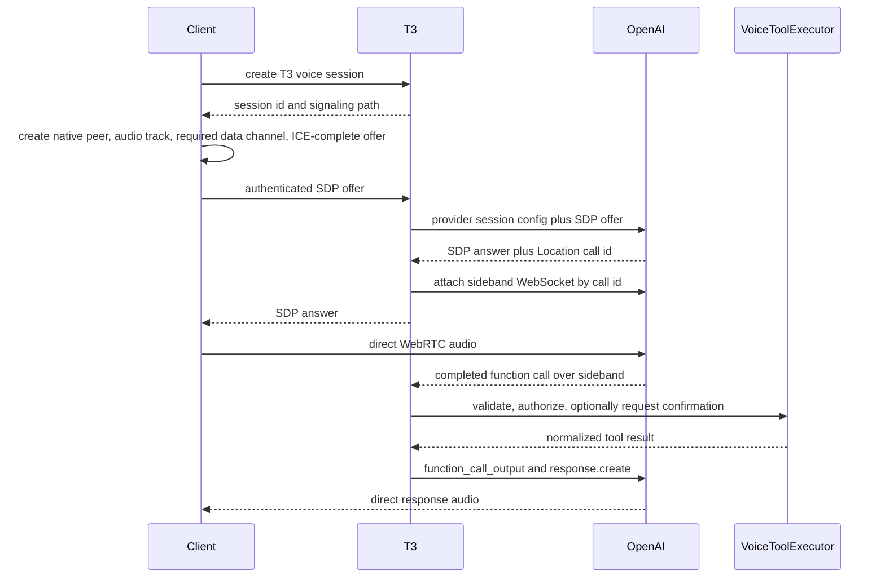

# Voice Architecture

## Status

This document defines the target architecture and implementation plan for T3 voice support.
Android is the first implementation target. The contracts and server ownership model are shared
from the beginning so iOS and desktop clients can implement the same capabilities without changing
the server protocol.

The design has three independent capabilities:

1. bounded speech-to-text for dictation;
2. streaming text-to-speech for reading T3 content;
3. low-latency realtime voice-agent sessions with server-owned T3 tools.

OpenAI is the first voice provider. Provider-specific models, credentials, configuration, tool
protocols, and event shapes remain inside server and platform provider adapters. Clients exchange
only versioned T3 contracts and standardized SDP; they never receive provider credentials or raw
provider control events.

## Decision Summary

- T3 server is the credential, policy, signaling, tool-execution, and audit authority.
- Platform clients own microphone capture, playback, WebRTC, audio routing, and foreground media
  lifecycle.
- Bounded transcription uploads and streaming synthesized audio pass through authenticated T3 HTTP
  media endpoints.
- Realtime agent audio flows directly between the platform client and OpenAI over WebRTC.
- T3 proxies WebRTC session negotiation, captures the provider call ID, and attaches a sideband
  WebSocket to the same provider session.
- Realtime tools execute only on the T3 server against the existing orchestration services.
- Voice tools are a narrow allowlist. No shell, terminal, filesystem, git, or arbitrary MCP tool is
  exposed in the initial implementation.
- Mutating voice tools use a server-enforced interaction policy: create/send dispatch immediately
  with durable idempotency, while interrupt/archive require confirmation.
- No standard provider API credential is delivered to a client.
- Raw audio is not persisted by default.
- Voice sessions are not provider coding sessions. They are short-lived control sessions that can
  inspect and command durable T3 threads.
- Provider calls are never the durable conversation identity. T3 owns a `VoiceConversationId` that
  can span call rotation, reconnects, and device handoff.

## Goals

- Add native Android push-to-talk dictation and streamed speech playback.
- Add an OpenAI Realtime voice agent capable of controlling T3 projects and threads.
- Preserve the same authenticated environment boundary used by other remote T3 operations.
- Keep media latency low without turning the T3 server into an audio relay for Realtime sessions.
- Define provider-neutral contracts and services that support additional voice providers.
- Make platform-specific media implementations replaceable and independently testable.
- Support interruption, cancellation, reconnects, partial provider failures, and process lifecycle
  transitions predictably.
- Provide enough telemetry to diagnose latency and media failures without logging credentials or
  raw audio.

## Non-goals

- Ambient wake-word detection.
- Always-on background microphone capture.
- General shell or filesystem control from the voice agent.
- Making the Realtime voice agent a coding-agent provider.
- Relaying Realtime audio through the T3 server.
- Sharing implementation code between Android and iOS media stacks.
- Hiding synthetic speech from the user. The UI must disclose that generated voices are AI voices.
- Representing a voice conversation as a T3 coding thread. A durable voice journal is a separate
  record; the user may explicitly send selected transcript content to a coding thread.

## Architecture

```text
Android / iOS / desktop client
  Voice UI and platform media adapter
       |                       |
       | authenticated HTTP    | WebRTC media
       v                       v
T3 environment server       OpenAI Realtime
  VoiceGateway                 ^
  VoiceSessionRegistry         | sideband WebSocket
  VoiceToolExecutor -----------+
  OpenAiVoiceProvider
       |
       +-- ServerSecretStore
       +-- ServerSettings
       +-- VoiceConversationRepository (SQLite)
       +-- ProjectionSnapshotQuery
       +-- ClientCommandDispatcher

T3 authenticated session-event stream --> platform client
```

There are two planes:

- **Media plane:** bounded upload/stream endpoints for STT and TTS, plus direct WebRTC media for a
  Realtime agent.
- **Control plane:** authenticated session creation, capability discovery, signaling, sideband
  provider events, tool execution, state projection, and cancellation.

Binary media is not encoded into the existing JSON RPC protocol. Voice control and state use typed
schemas, while media endpoints use their native content types and streaming bodies.

## Domain Model

### Capability types

```ts
type VoiceCapability =
  | "transcription.request"
  | "transcription.realtime"
  | "speech.streaming"
  | "agent.realtime";
```

The server advertises capabilities instead of forcing clients to infer them from provider names.
Each capability includes supported input/output formats, limits, and whether it is currently ready.

### Identifiers

The shared contracts define branded identifiers:

- `VoiceSessionId`: T3-owned session identity.
- `VoiceConversationId`: T3-owned durable semantic conversation identity.
- `VoiceRequestId`: bounded STT/TTS request identity.
- `VoiceToolCallId`: provider tool-call identity normalized at the T3 boundary.

Provider call IDs and response IDs remain inside the server provider adapter. They may be included
in redacted diagnostics but are not the T3 domain identity.

## Conversation, Session, and Provider Call

T3 deliberately separates three lifetimes:

1. **Voice conversation**
   - T3 product-level identity represented by `VoiceConversationId`.
   - Contains normalized text turns, compacted summaries, tool results, and selected T3 context.
   - Can outlive a provider call and continue on another device.
2. **Voice session**
   - One active T3 client attachment represented by `VoiceSessionId`.
   - Owns one media connection, one fenced client lease, pending confirmations, and transient UI
     state.
   - Ends on explicit stop, takeover, expiry, unrecoverable media loss, or server shutdown.
3. **Provider call**
   - OpenAI Realtime resource identified internally by the provider `call_id`.
   - Owns the provider's in-memory Session object and Conversation items for that call.
   - Has a provider-defined maximum duration and is never used as a durable T3 ID.

There is no permanent master OpenAI call. A durable T3 voice conversation is materialized through
a sequence of bounded provider calls:

```text
VoiceConversationId
  +-- VoiceSessionId on Android
  |     +-- OpenAI call_id A
  +-- VoiceSessionId on desktop after handoff
  |     +-- OpenAI call_id B
  +-- VoiceSessionId after expiry and client restart
        +-- OpenAI call_id C
```

### Durable conversation journal

For conversations with continuity enabled, T3 persists a normalized journal containing:

- final user transcripts;
- final assistant output transcripts;
- compacted summaries;
- normalized tool name, target IDs, confirmation outcome, and compact result;
- active project/thread context changes;
- call boundary and device-handoff markers.

T3 does not persist raw audio, SDP, provider credentials, provider event dumps, or partial audio
deltas. Partial transcripts are ephemeral UI events and are persisted only after finalization.

The journal is the continuity source of truth. The provider's current in-memory Conversation is a
cache for low-latency inference, not the durable record.

### Starting and continuing

Starting voice offers two explicit choices:

- **New conversation:** creates a new `VoiceConversationId` with no prior voice history.
- **Continue conversation:** selects an existing conversation and creates a new session seeded with
  its current compacted summary, recent turns, relevant tool outcomes, and current T3 context.

T3 chooses the bounded continuation window. A client cannot upload arbitrary hidden history as
trusted context.

### Reset and compaction

The user can reset in two ways:

- **New conversation** is a hard semantic reset and receives a new conversation ID.
- **Clear context** starts a new epoch on the existing conversation. Earlier journal entries remain
  visible in history until deleted, but they are excluded from future provider context.

Context selection is T3-owned. The current implementation disables OpenAI automatic truncation and
compiles the newest journal entries that fit the configured token budget whenever a new provider
call starts. Explicit clear-context advances the journal epoch before another call can use the old
entries. Automatic summary generation and seamless context-limit rotation are follow-up work; an
unexpected provider context-limit error ends the current call instead of silently dropping history.

### Device handoff

A voice conversation has at most one active media lease. To continue on another device:

1. the new device requests takeover of the `VoiceConversationId`;
2. T3 atomically increments the media-lease generation, fences the old session, commands its native
   peer to close, explicitly terminates the old provider call, and closes the server sideband;
3. pending write confirmations are invalidated and must be requested again;
4. T3 creates a new voice session and provider call for the new device;
5. the new provider call is seeded from the T3 summary and recent normalized turns;
6. the new device negotiates its own microphone, output route, voice, and WebRTC connection.

This is semantic continuation, not transfer of a live WebRTC peer connection. Completed history and
tool outcomes continue. Uncommitted microphone audio, partially played output, acoustic/prosodic
context, and incomplete provider responses do not.

Changing a Realtime model, provider, device, or output voice does not discard T3 conversation
history. It creates a call boundary and rehydrates the new provider call from the provider-neutral
journal. A voice that has already produced audio cannot be changed inside that OpenAI call, but a
new call may use a different voice. Bounded STT/TTS preset changes affect only their next request.

### Temporary disconnects

The native service lets an existing WebRTC peer handle short network interruptions. It may continue
only if that peer returns to `connected` while its fenced voice-control lease remains live. A native
heartbeat and the server sideband, not the React runtime socket, establish liveness. If either
control side is lost beyond the grace period, the native service closes its peer and T3 explicitly
terminates the provider call. Process loss, `failed`/`closed` peers, and terminal provider events
require a new call from journaled context; no provider-call resumption is assumed.

### Modes

```ts
type VoiceSessionMode = "realtime-transcription" | "realtime-agent";
```

Bounded STT and TTS are requests, not durable sessions. Realtime transcription and Realtime agents
are sessions with explicit ownership and cleanup.

### Session state

```ts
type VoiceSessionPhase =
  | "creating"
  | "signaling"
  | "connecting"
  | "idle"
  | "listening"
  | "thinking"
  | "speaking"
  | "confirming"
  | "reconnecting"
  | "ending"
  | "ended"
  | "error";
```

State updates carry a monotonically increasing T3 sequence and relevant correlation IDs. Clients
must not infer a total ordering from provider events alone.

## Shared Contracts

Voice schemas belong in `packages/contracts/src/voice.ts`. That package remains schema-only.

The initial contract surface includes:

- capability descriptors and limits;
- transcription metadata and result;
- speech request metadata;
- voice session create input and result;
- WebRTC offer/answer metadata;
- a normalized `VoiceSessionEvent` union for state, final/partial transcripts, tool progress,
  confirmation requests, lease fencing, rotation, and errors;
- tool call, confirmation request, confirmation response, and tool result summaries;
- typed public errors.

Provider-specific session JSON is never accepted from a client. The server owns model, voice,
instructions, tools, VAD, audio formats, and provider feature flags.

## Authorization

Add `voice:use` to `AuthEnvironmentScope` and the standard client scope grant. Add administrative
`voice:manage` for credential status/set/clear. Media, conversation, session, event, and
confirmation operations require `voice:use`; provider credential mutation requires `voice:manage`.

Tool execution also checks the scope required by the underlying operation on every call:

- read tools require `orchestration:read`;
- mutating tools require `orchestration:operate`;
- voice confirmation does not add authority; for confirmation-gated operations it only satisfies
  the interaction policy for an already-authorized operation.

The authenticated session ID and immutable granted scopes are captured in the T3 voice session.
They are not accepted from a client payload or provider tool arguments. `VoiceSessionRegistry`
subscribes to `SessionStore.streamChanges` and closes voice sessions when their client auth session
is removed. A final active-session check precedes each write.

Current environments are single-user trust domains: any paired client with `voice:use` can list and
continue that environment's durable voice conversations and can explicitly request takeover. Auth
`subject` is not treated as a cross-device user identity. Handoff never moves a journal between T3
environment servers; multi-user conversation ACLs require a future identity design.

## Server HTTP Surface

### Capability discovery

```text
GET /api/voice/capabilities
```

Returns provider-neutral readiness, supported capabilities, media formats, maximum upload size,
maximum realtime duration, and server policy. It never returns provider credentials.

### Conversations and event stream

```text
POST /api/voice/conversations
GET /api/voice/conversations
GET /api/voice/conversations/:voiceConversationId
DELETE /api/voice/conversations/:voiceConversationId
POST /api/voice/conversations/:voiceConversationId/clear-context
WsVoiceSubscribeSessionRpc(voiceSessionId)
```

Conversation creation chooses `ephemeral` or `durable` retention explicitly. Durable conversations
appear in list results; ephemeral conversations remain in memory and never appear in durable
history. Clear-context creates a new journal epoch. Delete hard-deletes transcripts, summaries,
context, and tool-call records after ending any lease. Automated age and size retention is not part
of the current implementation.

The authenticated RPC subscription carries normalized, sequenced `VoiceSessionEvent` values. It is
authorized against the current lease generation. React may detach without ending native media; the
native service separately maintains the lease heartbeat and closes its peer if server control is
lost.

### Bounded transcription

```text
POST /api/voice/transcriptions
Content-Type: multipart/form-data
```

Parts:

- `audio`: required bounded audio file;
- `metadata`: JSON containing optional language and T3-provided vocabulary context.

Response is newline-delimited JSON so recognition can render deltas while the provider finishes:

```json
{"type":"delta","requestId":"voice-request-...","text":"transcribed"}
{"type":"delta","requestId":"voice-request-...","text":" text"}
{"type":"final","result":{"requestId":"voice-request-...","text":"transcribed text","language":"en"}}
```

`language` is optional and echoes the accepted request hint; provider language detection is not
part of the initial contract. The final event is authoritative. Push-to-talk capture is still
bounded and uploads after stop; live microphone transcription uses `realtime-transcription`.

The server currently enforces the configured byte limit before calling the provider. Trusted
container/codec duration probing is still required before the server can advertise and enforce a
duration limit against untrusted clients. The OpenAI adapter initially uses `gpt-4o-transcribe`;
the model is server-owned and is not exposed as an arbitrary client string.

### Streaming speech

```text
POST /api/voice/speech
Content-Type: application/json
Accept: audio/pcm
```

The request includes an ordered playback ID, segment index, final-segment marker, text, and a
server-defined voice preset. The response is a cancellable, backpressured PCM stream. The first
format is 24 kHz, mono, signed 16-bit little-endian PCM.

For a still-streaming T3 thread response, the client phrase chunker emits completed sentences or
bounded clauses without waiting for the full message. The client serializes phrase requests, gives
each response PCM chunk a playback-global monotonic chunk index, and forwards it immediately to
native playback. Native playback drains those chunks in index order and begins as soon as the first
bytes arrive. It coalesces undersized clauses, caps segment size and queue depth, and cancels the
active request plus queued chunks on Stop,
interruption, thread retarget, or environment change. This avoids a custom duplex HTTP protocol
while still speaking before the text response finishes. When the source message completes, React
calls `finishPlaybackAsync({ playbackId, finalChunkIndex })` even if no unsynthesized text remains;
native then ends the queue after that chunk instead of requiring an empty final TTS request.

The OpenAI adapter initially uses `gpt-4o-mini-tts`. Voice and instruction presets are configured
on the server. Clients cannot submit arbitrary provider configuration.

### Realtime session creation

```text
POST /api/voice/sessions
DELETE /api/voice/sessions/:voiceSessionId
```

Create input includes:

- mode;
- a tagged `NewConversation` or `ContinueConversation` choice;
- optional active project and thread IDs;
- client media capabilities;
- client-generated idempotency key;
- explicit takeover intent when continuing an actively leased conversation.

Create returns the T3 voice session ID, policy, initial state, and an opaque WebRTC signaling path.
It does not contact OpenAI until the client submits an offer, preventing abandoned pending sessions
from consuming provider resources.

### WebRTC signaling

```text
POST /api/voice/sessions/:voiceSessionId/webrtc-offer
Content-Type: application/sdp
Accept: application/sdp
```

The server:

1. verifies session ownership and state;
2. constructs the provider session configuration;
3. forwards multipart SDP plus server-owned session JSON to OpenAI;
4. reads the OpenAI `Location` header and extracts the call ID;
5. opens the provider sideband WebSocket for that call;
6. returns the SDP answer only after the sideband is attached.

Sideband failure terminates the newly created provider call, marks the T3 session failed, and never
returns a usable answer. Every signaling operation carries the voice session ID and lease generation
so a late SDP answer cannot attach to a replacement session.

After negotiation, WebRTC audio flows directly between the client and OpenAI. T3 remains attached
to the provider session for tools and control.

### Confirmation

```text
POST /api/voice/sessions/:voiceSessionId/confirmations/:confirmationId
```

The body contains `approve` or `reject`. Confirmation IDs are single-use, short-lived, bound to the
session principal, normalized tool name, and canonical arguments. A confirmation cannot be replayed
with changed arguments.

### Media tickets

```text
POST /api/voice/media-tickets
```

The authenticated React runtime requests a one-use ticket bound to its auth session, operation
(`transcription-upload`, `speech-stream`, or `voice-heartbeat`), optional voice session/request ID,
method, path audience, byte limit, and short expiry. Native code uses it for the corresponding
background-capable HTTP operation. Tickets are stored only in memory, cannot mint other tickets,
and are invalidated by use, expiry, auth-session revocation, or voice-session closure.

## Provider Interfaces

Server runtime interfaces live under `apps/server/src/voice/Services/`.

### Transcriber

```ts
interface Transcriber {
  readonly transcribe: (request: TranscriptionRequest) => Effect<TranscriptionResult, VoiceError>;
}
```

### SpeechSynthesizer

```ts
interface SpeechSynthesizer {
  readonly synthesize: (request: SpeechSynthesisRequest) => Stream<Uint8Array, VoiceError>;
}
```

### RealtimeVoiceProvider

```ts
interface RealtimeVoiceProvider {
  readonly negotiate: (
    request: RealtimeNegotiationRequest,
  ) => Effect<RealtimeProviderSession, VoiceError, Scope>;
}
```

`RealtimeProviderSession` exposes the SDP answer, a normalized event stream, session update/control
operations, tool output submission, explicit provider-call termination, and an explicit close
operation. OpenAI event parsing and provider Realtime/function call IDs do not leak through this
interface.

### Registry and gateway

- `VoiceProviderRegistry` resolves the configured provider adapter per capability.
- `VoiceGateway` validates requests and invokes bounded provider operations.
- `VoiceSessionRegistry` owns scoped realtime sessions, quotas, idempotency, cancellation, and final
  cleanup.
- `VoiceConversationRepository` persists normalized turns, summaries, context epochs, and call
  boundaries without retaining audio.
- `VoiceContextCompiler` creates the bounded provider-neutral continuation context used for new
  calls and handoff.
- `VoiceToolExecutor` maps normalized tool calls to T3 application services.
- `ClientCommandDispatcher` is extracted from `apps/server/src/ws.ts` and owns setup/worktree,
  startup queue, dispatch, archive cleanup, and terminal-close semantics. WebSocket, orchestration
  HTTP, and voice writes all call it; voice never dispatches directly to
  `OrchestrationEngineService`.

The OpenAI implementation lives under `apps/server/src/voice/Providers/OpenAi/` and depends on an
HTTP/WebSocket client abstraction so tests never require network access.

## Provider Extensibility

Provider abstraction is part of the first implementation, but OpenAI is the only production adapter
required for the initial release. T3 does not implement speculative adapters or reduce every
provider to a lowest-common-denominator protocol.

The abstraction follows capabilities rather than vendors:

- a provider may implement transcription without synthesis;
- a provider may implement synthesis without a Realtime agent;
- bounded and Realtime transcription may come from different provider instances;
- a Realtime provider declares the media transports and features it actually supports.

Clients receive provider-neutral capability descriptors and server-owned presets. They never
receive provider model IDs, API URLs, raw event names, tool schemas, or standard credentials.

Realtime media negotiation uses a versioned transport union. The first member is
`webrtc-sdp-v1`. Future transports are added only when a real provider requires them and a platform
adapter exists. Unknown transports fail as unsupported; there is no fallback that silently changes
media or security behavior.

```ts
type VoiceMediaTransport = {
  readonly kind: "webrtc-sdp-v1";
  readonly signalingPath: string;
};
```

Provider adapters normalize their native events into T3 session events. Conversation persistence,
context compilation, authorization, tools, confirmations, quotas, and audit behavior remain T3
services and are never delegated to an adapter.

The test suite includes a fake provider that implements the same interfaces. Passing those tests is
the proof that OpenAI has not leaked into domain contracts; building a second production adapter is
not required to prove the boundary.

## OpenAI Realtime Flow

T3 uses OpenAI's unified WebRTC interface rather than delivering client secrets to the app.



Realtime sessions are bounded resources. Before the OpenAI 60-minute maximum, T3 emits a terminal
rotation-required event and closes the current native peer/provider call. The client starts a new
`VoiceSessionId` against the same durable conversation, which recompiles continuation context and
creates a new provider call. The current implementation accepts this explicit restart rather than
attempting an atomic peer swap. It never models a Realtime session as a durable T3 thread.

## Realtime Tools

The initial allowlist is:

- `list_projects`
- `list_threads`
- `get_thread_status`
- `create_thread`
- `send_thread_message`
- `interrupt_thread`
- `archive_thread`

Read tools query `ProjectionSnapshotQuery`. Write tools create canonical orchestration commands and
dispatch them through `ClientCommandDispatcher`. They do not call HTTP or WebSocket routes from
inside the server.

Tool contracts use stable T3 IDs, bounded strings, and explicit result limits. Lists require a
limit and return compact summaries. The server rejects unknown fields and unknown tool names.

### Thread history and asynchronous turn completion

The voice agent must be able to inspect the existing coding-thread conversation, not merely its
shell status. Add a bounded `get_thread_messages` read tool backed by the orchestration thread-detail
snapshot. It accepts a thread ID plus cursor and limit, returns normalized user/assistant messages
with turn and completion metadata, and never places an unbounded transcript in Realtime context.
Activities, diffs, plans, and tool output remain separate bounded queries rather than being folded
into message text.

Sending work to a coding thread and receiving its result are separate operations because a coding
turn may take minutes, request approval or user input, or be steered while it is running.
`send_thread_message` returns the orchestration command, message, and turn identifiers immediately.
T3 then follows the existing thread-detail event stream and offers both completion mechanisms:

- `wait_for_thread_turn` performs a cancellable, bounded wait when the Realtime agent explicitly
  needs the result during its current response. It returns the final assistant message and terminal
  state, or a typed timeout, interruption, failure, approval-required, or user-input-required result.
- An asynchronous watcher journals a compact completion result and injects a normalized completion
  notification into the active Realtime provider call. If the originating call has ended, the
  notification remains in the durable voice journal and is included when that conversation is next
  continued. Provider adapters implement notification delivery; orchestration completion tracking
  remains provider-neutral.

The server correlates completions by T3 turn ID, not by provider function-call ID or whichever
thread is currently focused. It deduplicates terminal delivery across reconnects, call rotation,
and process recovery. The asynchronous path is the default for long-running turns; the bounded wait
is a convenience, not a permanently blocking HTTP request.

### Confirmation policy

- Read tools execute immediately.
- `create_thread` and `send_thread_message` dispatch immediately with deterministic command IDs and
  durable idempotency. Their receipts report accepted dispatch metadata, not downstream completion.
- `interrupt_thread` and `archive_thread` always require confirmation in the initial release.
- Confirmation enforcement is server code, not prompt text.
- T3 holds the completed provider function call without submitting output while confirmation is
  pending; the model prompt requires a spoken preamble before requesting the tool.
- Only a T3 client confirmation endpoint resolves it. Approval executes the tool; rejection or
  expiry produces a rejection result. Exactly one final `function_call_output`, followed by
  `response.create`, is submitted for the provider function-call ID.

Each provider function call is normalized to a durable `VoiceToolCallId`. T3 persists canonical
arguments and pending/terminal state before confirmation or execution and derives a deterministic
orchestration `CommandId` from conversation ID plus tool-call ID. A tool result is journaled before
provider acknowledgement. Late events must match the current lease generation; completed writes
are reconciled from orchestration command receipts after a crash rather than executed again.

## Server Settings and Secrets

Add provider-neutral voice settings to `ServerSettings`:

```ts
voice: {
  enabled: boolean;
  maxUploadBytes: number;
  maxConcurrentSessions: number;
  contextTokenBudget: number;
}
```

Retention is selected explicitly per conversation. Provider selection and provider-specific
non-secret configuration belong in a future voice provider instance map; the initial registry has
one OpenAI adapter. Secret fields are persisted through `ServerSecretStore` and never reach a
client.

The initial OpenAI adapter pins its transcription, speech, Realtime models, voice preset map, and
request behavior on the server. Moving those non-secret choices into a provider instance map is a
follow-up that does not change client contracts. Credential status/set/clear use a separate
`voice:manage` API backed by `ServerSecretStore`; the API key is never a `ServerSettings` field or
returned through `server.getSettings`.

## Android Client

### Source layout

```text
apps/mobile/modules/t3-voice/
  package.json
  expo-module.config.json
  android/build.gradle
  android/src/main/AndroidManifest.xml
  android/src/main/java/expo/modules/t3voice/
    T3VoiceModule.kt
    T3VoiceRuntimeService.kt
    T3VoiceMediaEngine.kt
    T3VoiceWebRtcSession.kt
    T3VoiceAudioPlayer.kt
    T3VoiceRecorder.kt
    T3VoiceStateStore.kt
  src/
    index.ts
    T3Voice.types.ts

apps/mobile/src/features/voice/
  nativeVoiceModule.ts
  voiceRuntime.ts
  voiceState.ts
  useVoice.ts
  components/
```

The local module is autolinked using `expo-module.config.json`, matching existing T3 native modules.
No durable source change is made only under generated `apps/mobile/android`.

### Native bridge

`T3VoiceModule` exports these Android bounded-media operations and events:

- `getMediaCapabilitiesAsync`
- `getStateAsync`
- `getMicrophonePermissionAsync`
- `requestMicrophonePermissionAsync`
- `startRecordingAsync`
- `stopRecordingAsync`
- `cancelRecordingAsync`
- `deleteRecordingAsync`
- `startPlaybackAsync`
- `enqueuePlaybackChunkAsync`
- `finishPlaybackAsync`
- `cancelPlaybackAsync`
- `stateChanged`
- `playbackChunkConsumed`
- `runtimeError`

The Realtime phase extends the same local module with:

- `prepareRealtimeSession` (returns a native session ID and ICE-complete SDP offer)
- `applyRealtimeAnswer` (requires the same native session ID)
- `stopRealtimeSession`
- `setAudioRoute`

React Native owns UI composition, authenticated signaling, and selected environment/thread state.
The foreground service owns active media, audio focus, routing, and the realtime peer connection.
It creates the provider-required data channel but never exposes raw provider JSON through Expo;
normalized state arrives on the T3 event subscription.

### Media ownership

- Bounded dictation records a supported compressed format when practical and uploads it only after
  the user ends the utterance.
- Streaming PCM TTS is written incrementally to `AudioTrack` with cancellation and audio focus.
- Realtime sessions use WebRTC's native audio device path instead of manually copying realtime PCM
  through JavaScript.
- The first Android engine is exactly pinned `io.github.webrtc-sdk:android:144.7559.09`, isolated behind
  `T3VoiceWebRtcSession`, and reviewed for security, version age, ABI size, and 16 KB page support
  before release. `AudioRecord`/`AudioTrack` are bounded STT/TTS paths only.
- Only one capture owner exists at a time. Starting capture stops conflicting playback unless the
  active mode explicitly supports barge-in.
- Bluetooth, wired headset, speaker, and earpiece routes are represented as stable platform-neutral
  route descriptors.

### Foreground service

The foreground service owns media that must survive React activity recreation. It does not start an
ambient microphone and does not start microphone capture from the background.

The Android library manifest declares:

- `RECORD_AUDIO`
- `MODIFY_AUDIO_SETTINGS`
- `POST_NOTIFICATIONS`
- conditional `BLUETOOTH_CONNECT` on Android 12+;
- `FOREGROUND_SERVICE`
- `FOREGROUND_SERVICE_MEDIA_PLAYBACK`
- `FOREGROUND_SERVICE_MICROPHONE`
- an unexported service with `foregroundServiceType="mediaPlayback|microphone"`.

Microphone permission is requested while the app is visible. A microphone foreground service is
started only from that user-visible action and calls `startForeground` immediately with matching
microphone/media-playback types. It uses `START_NOT_STICKY`; process death closes the local peer and
requires a fresh session. The notification Stop action closes capture, playback, and peer without
React. Notification denial reduces visibility but does not block service start. Bluetooth denial
removes Bluetooth route control. The service stops when neither capture nor background playback
remains.

The service never retains a module, React context, or Activity. A local Binder and process-scoped
`StateFlow` expose state snapshots. The Expo module subscribes in `OnStartObserving`, detaches in
`OnStopObserving`/`OnDestroy`, and calls `getState` after reattachment.

### Credential boundary

The native module receives only the selected T3 environment endpoint and one-use media tickets
minted by the server through the existing authenticated React client runtime. It does not receive
an OpenAI credential or the main long-lived T3 credential.

Long-lived T3 bearer or DPoP credentials remain in existing mobile secure storage and are never
copied into the native service or plain SharedPreferences. Media tickets live in memory only and
are refreshed by the authenticated runtime while attached.

### React Native state

Voice state is environment-scoped. Switching environments or removing the active environment ends
the active voice session. Switching threads updates the context available to the voice agent but
does not silently retarget a pending mutating tool call.

### Follow-up addendum: application-level master voice

The Realtime agent is an environment-level master voice conversation, not a child of the coding
thread from which it was started. Its controller and transcript surface live above thread-detail
navigation. Opening another ordinary T3 thread therefore does not close the Realtime call. The
selected project and thread become the agent's visible focus for subsequent discussion, while every
tool invocation continues to carry an explicit project or thread ID. A focus change never rewrites
the target of a pending confirmation or an already-issued mutation.

The mobile UI keeps a persistent master-voice call bar available across project and thread screens.
It shows call state, mute, audio route, current focus, transcript access, and hangup. The separate
durable voice conversation remains the source of history; it is not inserted into the ordinary
coding-thread list or represented as a provider-backed coding thread.

T3 permits only one microphone-owning voice mode at a time. If the user starts a thread-local voice
interaction, such as bounded dictation or a future thread-scoped hands-free mode, while the master
Realtime call is active, the client explicitly stops the Realtime session before starting the
thread-local mode. Stopping closes the native peer, terminates the provider call and sideband, and
invalidates or rejects unresolved tool confirmations. Finalized transcript and tool history remain
in the durable master voice conversation.

Returning to master voice does not attempt to resurrect the previous WebRTC connection or provider
call. The user explicitly resumes the same durable voice conversation, and T3 creates a new
`VoiceSessionId`, compiles the retained context, and negotiates a new provider call. The UI labels
this action Resume rather than implying that the old media connection remained alive. Switching
environments still ends the master call because voice conversations, authorization, tools, and
thread identities are environment-scoped.

The UI provides:

- push-to-talk dictation in the composer;
- play/stop controls on eligible assistant messages;
- a visible Realtime voice-session surface;
- input/output route status;
- explicit confirmation UI for mutating tools;
- synthetic-voice disclosure;
- clear error and reconnect states.

## iOS and Desktop

The cross-platform contracts do not mention Expo, Android services, AudioTrack, or Android audio
routes.

Future adapters implement the same platform media interface:

- iOS: local Expo module using AVAudioSession, AVAudioEngine, and native WebRTC.
- Desktop web: browser WebRTC and Web Audio, controlled by the shared client runtime.
- Desktop native shells: optional native media adapters when browser media is insufficient.

All clients use the same server signaling, capability, confirmation, and bounded media endpoints.

## Reliability and Lifecycle

### Bounded requests

- Upload and synthesis requests have explicit byte, duration, and wall-clock limits.
- Disconnecting the client cancels the upstream provider request.
- TTS streaming propagates backpressure instead of buffering the complete response.
- Request IDs are returned in errors and telemetry.

### Realtime sessions

- `VoiceSessionRegistry` owns one Effect scope per provider session.
- Ending a T3 session interrupts sideband readers, tool fibers, timers, and provider connections.
- Native control heartbeats own client liveness in every session phase. Missing heartbeats end the
  session after the bounded failure grace even when provider media was previously active; the
  Android foreground service keeps those heartbeats alive while React is suspended or the screen
  is locked. Provider closure and the absolute session-duration limit remain independent terminal
  conditions.
- Ordinary React event-subscription disconnect does not close healthy native media. A recreated
  controller explicitly stops and reconciles an orphaned native peer before starting another call.
- Provider errors are normalized into recoverable, terminal, or policy failures.
- Tool execution survives duplicate provider events through idempotency records.
- Session duration is capped below the provider maximum and exposed to the client.

### Process failure

Realtime sessions are intentionally ephemeral and are not reconstructed after a T3 server restart.
The native client detects control-heartbeat loss and closes its peer; after the server returns it can
explicitly start a new session. Durable voice
conversations survive restart because the normalized journal is persisted. Starting again creates
a new provider call from compiled T3 context; no hidden fallback claims to have reconstructed the
old provider session.

## Security and Privacy

- Provider credentials remain in `ServerSecretStore`.
- Every voice endpoint authenticates the T3 principal and checks `voice:use`.
- Every tool call rechecks its underlying orchestration scope.
- T3 accepts no client-provided provider instructions, tools, API URLs, model IDs, or secrets.
- Model, voice, codec, tool, and instruction inputs are allowlisted server-side.
- Upload size, utterance duration, request rate, and concurrent session quotas are enforced before
  provider calls.
- A privacy-preserving stable safety identifier is attached to provider sessions where supported.
- Raw audio is not logged or retained by default.
- Final transcripts and compact summaries are persisted only for conversations with durable
  continuity enabled. Ephemeral conversations retain them only in memory for the active call.
- Users can start a new conversation, clear model-visible context, or delete a durable conversation.
- Logs redact provider credentials, SDP credentials, tool output content, and transcript text.
- Tool telemetry records normalized tool name, target IDs, outcome, timing, and confirmation state.
- Prompt injection tests cover spoken attempts to expand the tool allowlist or bypass confirmation.

## Observability

Metrics:

- STT upload bytes, duration, provider latency, and outcome;
- TTS time to first byte, stream duration, bytes, cancellation, and underruns;
- Realtime signaling latency, sideband attach latency, session duration, reconnects, and outcome;
- speech start to first response audio;
- tool selection, validation, authorization, confirmation, execution latency, and result;
- platform media route and audio-focus failures without device-identifying data.

Tracing uses T3 voice request/session IDs. Provider IDs are attributes only after redaction. Audio and
transcript bodies are excluded from spans.

The Android module writes a bounded app-private diagnostic event log containing state transitions,
route changes, numeric media counters, and sanitized errors.

## Testing Strategy

### Contracts

- schema round trips and rejection of unknown or malformed inputs;
- public error status mapping;
- capability compatibility fixtures;
- confirmation binding and expiration.

### Server unit tests

- provider registry selection and unavailable capabilities;
- OpenAI multipart transcription request construction;
- streaming PCM backpressure and cancellation;
- streamed transcription delta ordering and exactly one authoritative final event;
- phrase chunking, ordered multi-request TTS playback, and cancellation of queued segments;
- WebRTC multipart negotiation and `Location` call-ID parsing;
- sideband attach failure cleanup;
- provider event correlation;
- tool schema validation, authorization, confirmation, durable idempotency, and crash reconciliation;
- quotas, upload limits, timeouts, and redaction;
- session scope cleanup and reconnect grace periods;
- repository migrations, restart rehydration, clear-context epochs, retention, deletion, and
  deterministic context compilation;
- simultaneous takeover, stale lease generations, late old-call events, and failed replacement
  negotiation.

All normal tests use fake provider adapters and deterministic clocks. Network tests are gated and are
never required for the default suite.

### Server integration tests

- authenticated capability, STT, TTS, signaling, confirmation, and close routes;
- scope denial for voice and orchestration operations;
- auth-session revocation and native-control lease loss terminate provider work;
- two paired devices can explicitly hand off one conversation without sharing a live provider call;
- crash between orchestration dispatch and journal completion does not repeat a write;
- one read tool and one confirmation-gated write tool through a fake Realtime provider.

### Android tests

- Expo module contract and missing-native-module behavior;
- permission state transitions;
- recorder and PCM player state machines;
- recognition delta/final reconciliation and ordered segmented speech queues;
- audio focus and route changes;
- service start/stop and notification behavior;
- activity recreation while playback or Realtime media is active;
- WebRTC signaling and event correlation with a fake peer;
- cancellation and network-loss cleanup;
- clean Expo prebuild preserves module service and permissions in the merged manifest;
- late SDP answers cannot attach to a replacement native session.

### Device verification

- built-in microphone, speaker, wired headset, and Bluetooth headset;
- interruption and barge-in;
- screen off/on and activity recreation;
- network handoff and temporary loss;
- permission denial and revocation;
- long-running session rotation;
- noisy speech, accents, code terms, numbers, and filenames;
- end-to-end read tool and confirmed write tool on a disposable T3 project.

### Gated provider verification

With explicit credentials and opt-in:

- transcribe a checked-in non-sensitive audio fixture;
- synthesize PCM and validate format/playability;
- negotiate WebRTC and attach sideband;
- execute a read tool and a confirmation-gated write tool;
- measure interruption and first-audio latency.

## Implementation Plan

### 1. Contracts, authorization, and canonical command dispatch

- Add shared voice schemas and public errors.
- Add `voice:use` and administrative `voice:manage` authorization scopes.
- Add voice settings, redaction, secret persistence, and capability descriptors.
- Extract `ClientCommandDispatcher` from WebSocket-owned orchestration workflow and route existing
  WebSocket and HTTP commands through it before voice uses it.
- Add contract and settings tests.

Acceptance criteria:

- Existing settings remain decodable through schema defaults.
- No secret appears in serialized server settings.
- A paired standard client receives `voice:use`; restricted clients can omit it.
- Existing WebSocket/HTTP command behavior remains covered through the shared dispatcher.

### 2. Durable conversation foundation

- Add SQLite migrations for voice conversations, journal entries, compactions, and tool calls.
- Add `VoiceConversationRepository`, retention/deletion, and `VoiceContextCompiler` layers.
- Add create/list/get/delete/clear-context APIs and the atomic generation-fenced media lease.
- Persist only final normalized content and mark interrupted partial responses non-final.

Acceptance criteria:

- Durable context rehydrates deterministically after server restart; ephemeral context does not.
- Clear-context, hard delete, age/size retention, compaction, and call-boundary behavior are tested.
- Concurrent takeover permits one generation; stale provider events cannot journal or execute tools.

### 3. Server provider foundation

- Add provider-neutral Effect services and test layers.
- Add `OpenAiVoiceProvider` bounded STT and streaming TTS.
- Add authenticated media routes, one-use media tickets, cancellation, limits, and telemetry.
- Add credential status/set/clear APIs guarded by `voice:manage`.

Acceptance criteria:

- Fake-provider integration tests cover success, limits, cancellation, and authorization.
- Gated OpenAI STT/TTS verification succeeds without exposing the API key to a client.

### 4. Android native media and UI

- Add the local Expo module, library manifest, and native checks.
- Implement bounded recorder and streaming PCM playback.
- Add composer dictation and message play/stop controls.
- Add settings, route state, and synthetic-voice disclosure.
- Pin and isolate native WebRTC, and implement service-owned Binder/`StateFlow` lifecycle.

Acceptance criteria:

- Dictation inserts a transcript into the selected composer.
- Playback starts before the complete provider response is buffered and stops immediately.
- Native behavior survives activity recreation and cleans up after cancellation.

### 5. Realtime server control

- Add T3 session registry and WebRTC signaling route.
- Implement OpenAI negotiation and sideband adapter.
- Implement normalized state events, expiry, quotas, and cleanup.
- Implement read-only voice tools.
- Disable provider automatic truncation and rotate from compiled T3 context before provider limits.

Acceptance criteria:

- Android establishes direct WebRTC media while T3 observes the same session over sideband.
- The voice agent lists projects/threads and reads thread status through server tools.

### 6. Mutating tools and confirmation

- Add create/send/interrupt/archive tools.
- Add confirmation contracts, endpoint, UI, expiration, persisted tool calls, deterministic command
  IDs, and crash reconciliation.
- Add audit telemetry and adversarial tests.

Acceptance criteria:

- Create and send execute immediately with deterministic durable deduplication; interrupt and
  archive require valid server-side confirmation.
- Duplicate provider calls and confirmation replays do not duplicate orchestration commands.

### 7. Hardening and cross-platform readiness

- Complete Android route, Bluetooth, lifecycle, and network testing.
- Document server setup and provider configuration.
- Extract the platform media interface used by future iOS and desktop adapters.
- Run full repository and native quality checks.

Acceptance criteria:

- Android end-to-end device checklist passes.
- Server behavior is independent of Android implementation details.
- iOS and desktop adapters can be implemented without changing server contracts.
- `vp check`, `vp run typecheck`, and `vp run lint:mobile` pass.
- Clean Android prebuild, merged-manifest inspection, module unit tests, APK assembly/install, and
  connected device tests pass. Native voice changes are delivered in a rebuilt dev client, not
  Expo Go or an OTA-only update.

## Operational Setup

1. Configure the OpenAI voice provider and API secret on the T3 server.
2. Enable desired voice capabilities and choose server-owned model/voice presets.
3. Restart or reload server settings and verify `/api/voice/capabilities` reports ready.
4. Pair the client with a grant containing `voice:use` and required orchestration scopes.
5. Build a native client containing the platform voice module.
6. Grant microphone and notification permissions from visible client UI.
7. Run bounded STT/TTS diagnostics before enabling Realtime tools.
8. Run a Realtime read-only session, then enable confirmed write tools.

Provider failures leave ordinary T3 thread control operational. Voice readiness is reported as a
separate capability and never blocks server startup.

## References

- [OpenAI Realtime and audio](https://developers.openai.com/api/docs/guides/realtime)
- [OpenAI Realtime WebRTC](https://developers.openai.com/api/docs/guides/realtime-webrtc)
- [OpenAI server-side Realtime controls](https://developers.openai.com/api/docs/guides/realtime-server-controls)
- [OpenAI Realtime conversations and function calling](https://developers.openai.com/api/docs/guides/realtime-conversations)
- [OpenAI speech to text](https://developers.openai.com/api/docs/guides/speech-to-text)
- [OpenAI text to speech](https://developers.openai.com/api/docs/guides/text-to-speech)
- [OpenAI Realtime transcription](https://developers.openai.com/api/docs/guides/realtime-transcription)
- [Expo Modules API](https://docs.expo.dev/modules/module-api/)
- [Expo local modules](https://docs.expo.dev/modules/get-started/)
- [Expo Continuous Native Generation](https://docs.expo.dev/workflow/continuous-native-generation/)
- [Android foreground service types](https://developer.android.com/develop/background-work/services/fgs/service-types)

## Follow-Up: Hands-Free Bounded Conversation Mode

This is a follow-up task. Do not add it to the initial voice implementation or use it to expand the
initial acceptance criteria. Begin implementation only after bounded push-to-talk STT, streaming
TTS, cancellation, Realtime sessions, and Android lifecycle behavior are complete and have passed
the documented server, native, and connected-device tests.

The follow-up provides a hands-free conversation loop for an ordinary, non-Realtime T3 thread. It
composes the existing bounded STT and streaming TTS capabilities; it does not create an OpenAI
Realtime session or introduce another provider protocol.

### User flow

1. The user explicitly enables hands-free mode for the selected thread.
2. Android arms the microphone and uses local audio energy or VAD to detect speech onset.
3. End-of-speech silence, a maximum utterance duration, or an explicit control ends capture.
4. The bounded recording is transcribed and, according to the selected policy, either inserted for
   review or submitted to the thread automatically.
5. The ordinary thread response continues streaming as text. Phrase-chunked TTS begins before the
   text response completes.
6. After playback completes, the client waits for a short configurable guard interval and re-arms
   the microphone. The loop continues until explicitly paused or stopped.

The controller state machine is:

```text
paused -> arming -> listening -> endpointing -> transcribing
       -> submitting -> waiting -> speaking -> arming
```

Any active state may enter `recovering` for a bounded retry or `paused` for an explicit stop,
permission loss, environment change, thread retarget, repeated failure, or unsafe lifecycle state.

### Required behavior

- Listening starts only after an explicit user action and always has a visible in-app state and an
  Android foreground-service notification.
- Start-of-speech, end-of-speech silence, maximum utterance, transcription, response, and re-arm
  timers are independently bounded.
- Playback completion and cancellation are explicit native events; the controller does not infer
  completion from elapsed time.
- Canceling speech aborts current and queued TTS work but does not interrupt the underlying thread
  or its text stream.
- Stopping the thread response is a separate action from stopping speech or pausing hands-free
  listening.
- The microphone does not re-arm while TTS owns audio focus. A post-playback guard interval and
  platform echo controls prevent synthesized speech from being submitted as user input.
- Optional barge-in may stop TTS and begin a new bounded utterance without interrupting the thread
  text stream. It is disabled until echo rejection is verified on connected devices.
- Auto-submit and transcript-review are explicit modes. Auto-submit is never silently enabled by
  entering ordinary dictation.
- Network loss, permission revocation, audio-route changes, repeated empty transcripts, and repeated
  provider errors pause the loop instead of retrying indefinitely.
- Environment or thread changes cancel the current recording and playback and require an explicit
  re-arm against the new target.

### Implementation boundary

The first implementation should keep endpoint detection and foreground audio ownership in the
Android service. Shared TypeScript owns the product state machine, thread targeting, STT/TTS
requests, and submission policy. Final energy thresholds, silence windows, Kotlin event names, and
UI placement should be selected after the initial native recorder and playback APIs have passed
device testing.

No server contract change should be required. If implementation reveals that bounded STT, TTS
cancellation, playback completion, or independent thread cancellation cannot support this mode,
fix those primitives first rather than adding hands-free-specific server routes.

### Follow-up verification

- Unit-test every state transition, timeout, cancellation path, and retry limit with a virtual
  clock.
- Verify that stopping speech leaves the thread text response running and that stopping the thread
  does not silently re-arm listening.
- Verify no self-transcription across speaker, wired headset, and Bluetooth routes.
- Verify pause/stop from both the app and foreground notification while the activity is recreated,
  backgrounded, or the screen is off.
- Measure speech-onset detection, endpoint latency, transcript latency, first-audio latency, false
  starts, empty turns, and re-arm latency without retaining raw audio.

## Follow-Up: Screen-Off Headset Controls

This is a follow-up task modeled on the existing Assistant Android voice runtime. It is opt-in and
must not make the operation-scoped foreground service permanently active for users who do not want
headset controls.

Android cannot reliably start a microphone foreground service from an arbitrary background media
button event. When the user enables headset controls while T3 is visible, T3 therefore starts and
retains its voice foreground service, registers an active Android `MediaSession`, and displays an
ongoing notification. The already-running service can then receive headset events and begin audio
capture while the activity is backgrounded or the screen is off.

### Headset behavior

- An initial `ACTION_DOWN` event with repeat count zero for play, pause, stop, headset hook, or
  play/pause is eligible; key-up and repeated events are ignored.
- When no interaction is active, a supported button starts the configured action: bounded
  dictation, hands-free listening, or a Realtime conversation.
- While listening, speaking, or otherwise active, the same button stops the current voice
  interaction without implicitly stopping an ordinary T3 thread response.
- Media-session playback state mirrors idle versus listening/speaking state so Android and the
  headset route subsequent controls consistently.
- A notification action enables or disables headset controls and always exposes Stop while an
  interaction is active.
- Disabling headset controls deactivates and releases the media session. If no other voice feature
  needs persistent background ownership, it also stops the persistent foreground service.

### Lifecycle and safety

- Microphone and notification permissions are obtained before enabling the persistent mode.
- The initial foreground-service start occurs while the activity is visible; headset presses do
  not attempt to launch a dormant microphone service from the background.
- The service restores only explicitly persisted headset-control configuration after process
  recreation and uses a sticky restart policy only while that mode remains enabled.
- An actual Realtime call holds a partial CPU wake lock and, where device testing shows it is
  necessary, a high-performance Wi-Fi lock. Locks are scoped to active work, not the entire idle
  headset-control period.
- Audio focus, Bluetooth routing, call interruptions, permission revocation, and competing media
  sessions must move the runtime to a coherent idle or stopped state.
- The persistent notification must make background microphone readiness apparent and provide a
  one-tap way to disable it.

### Follow-up verification

- Verify idle-to-listen and active-to-stop headset toggles with wired, classic Bluetooth, and BLE
  headsets.
- Verify behavior with the activity backgrounded, removed from recents, recreated, and with the
  screen off through Doze entry.
- Verify the service cannot start capture after headset controls are disabled or permissions are
  revoked.
- Verify competing music and podcast media sessions regain control after T3 releases its media
  session.
- Verify persistent notification controls, process restart behavior, wake-lock release, and
  Realtime network continuity on the connected Android device.
